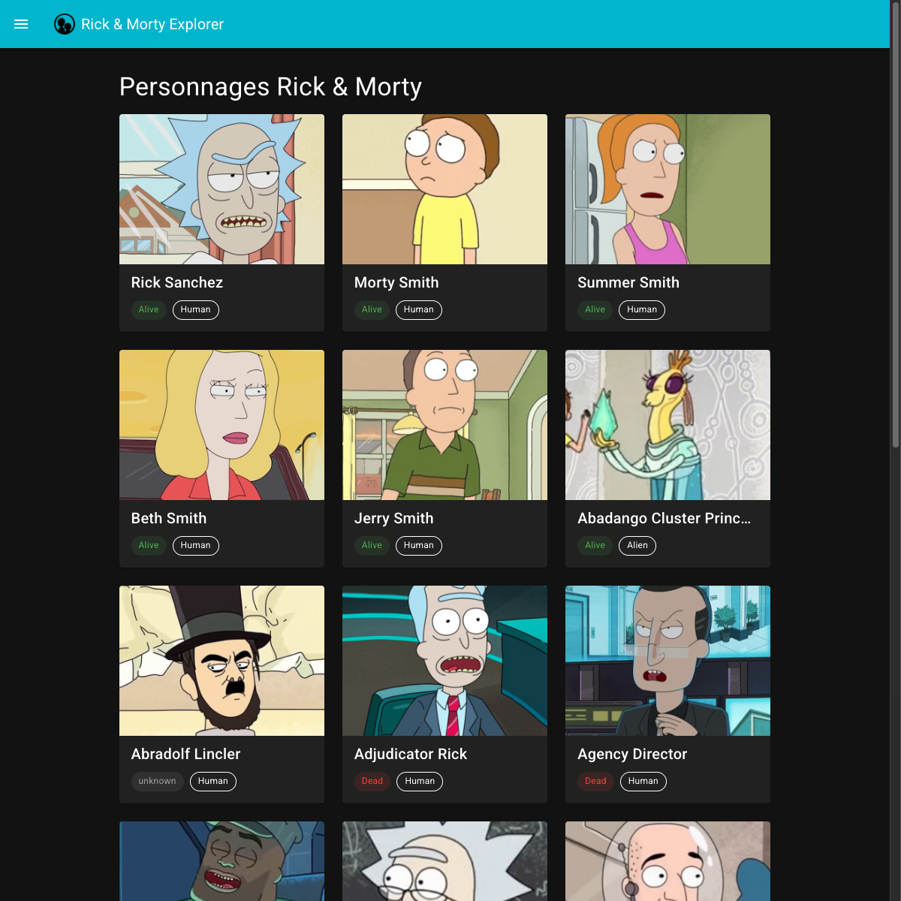
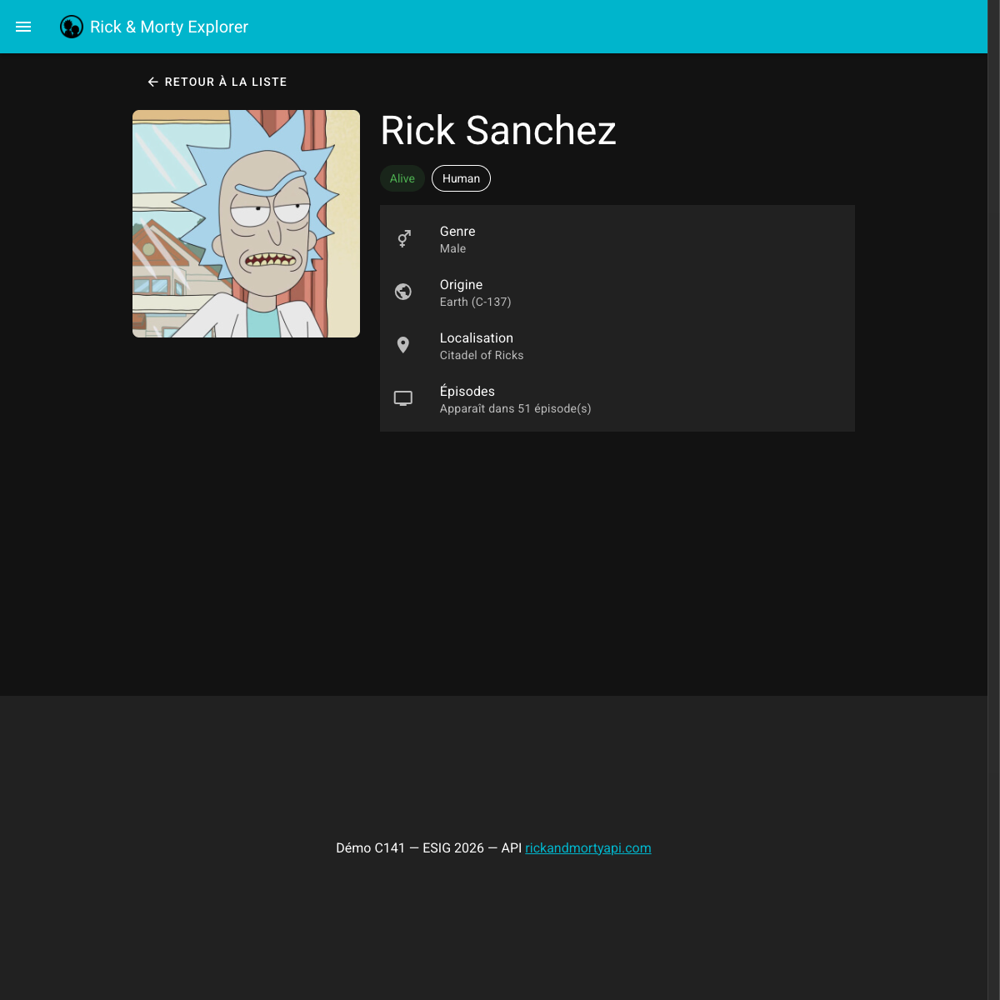
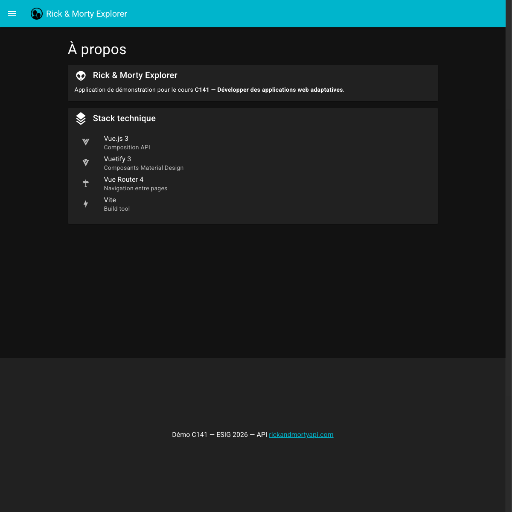

# Rick & Morty Explorer

Application Vue.js 3 + Vuetify 3 — code de départ pour le cours C141.

**[Voir la démo en ligne](https://fallinov.github.io/esig-141-demo-vuetify-api/)**



## Objectif

Compléter l'application en suivant les étapes du cours :

0. **Config** — Palette de couleurs Rick & Morty + favicon
1. **Découvrir l'API** — Requête GET dans Bruno, explorer le JSON
2. **API + affichage** — Charger et afficher les personnages avec `fetch()`
3. **Page statique** — Remplir la page À propos avec des composants Vuetify
4. **Navigation** — Ajouter un menu de navigation latéral
5. **Déploiement** — Déployer sur Vercel
6. **Fiche détail** (bonus) — Route dynamique, page détail d'un personnage

La branche [`solution`](https://github.com/fallinov/esig-141-demo-vuetify-api/tree/solution) contient le résultat final. Voir [`etapes-demo.md`](etapes-demo.md) pour le guide complet.

## Aperçu de la solution

| Page d'accueil | Fiche détail | À propos |
|:-:|:-:|:-:|
|  |  |  |

## Installation

```bash
git clone https://github.com/TheoBall-ESIG/141-JikanAPI-Project.git
cd 141-JikanAPI-Project
npm install
npm run dev
```

L'application s'ouvre sur [http://localhost:3000](http://localhost:3000).

## Structure

```
public/
├── favicon.ico          # Favicon multi-tailles (16, 32, 48px)
└── favicon.png          # Favicon PNG (tête de Gojo Satoru)
src/
├── assets/
│   └── gojoicon.png     # Icone de tête de Gojo Satoru 
├── components/
│   ├── AnimeCard.vue    # Card d'anime dans la liste d'accueil
│   ├── AppFooter.vue    # Pied de page
│   └── AppHeader.vue    # En-tête
├── pages/
│   ├── anime/
│   │   └── [id].vue         # Page de détail d'un anime
│   ├── a-propos.vue     # Card d'anime dans la liste d'accueil
│   ├── favoris.vue      # Footer
│   └── index.vue        # Header
├── plugins/
│   ├── axios.js         # Card d'anime dans la liste d'accueil
│   ├── index.js         # Footer
│   └── vuetify.js       # Header
├── routeur/
│   └── index.js         # Header
├── stores/
│   ├── animeStore.js    # Card d'anime dans la liste d'accueil
│   └── index.js         # Header
├── styles/
│   └── settings.scss    # Card d'anime dans la liste d'accueil
├── App.vue              #
└── main.js              #

```

## API Jikan

- **URL** : [`https://api.jikan.moe/v4`](https://api.jikan.moe/v4)
- **Documentation** : [https://docs.api.jikan.moe/](https://docs.api.jikan.moe/)
- **Réponse** : `{ data: [...], pagination: { has_next_page, items, ... } }`
- **Champs utiles** : `mal_id`, `title`, `title_english`, `title_japanese`, `images`, `score`, `scored_by`, `rank`, `popularity`, `episodes`, `duration`, `status`, `aired`, `type`, `source`, `rating`, `genres`, `studios`, `synopsis`, `year`

## Stack

- [Vue.js 3](https://vuejs.org/) — Composition API
- [Vuetify 3](https://vuetifyjs.com/) — Composants Material Design
- [Vue Router 4](https://router.vuejs.org/) + unplugin-vue-router (routage automatique)
- [Vite](https://vitejs.dev/) — Build tool

## Utilisation IA

Version gratuite de Claude pour aide à la résolution de problèmes et certaines fonctionnalités "avancées"