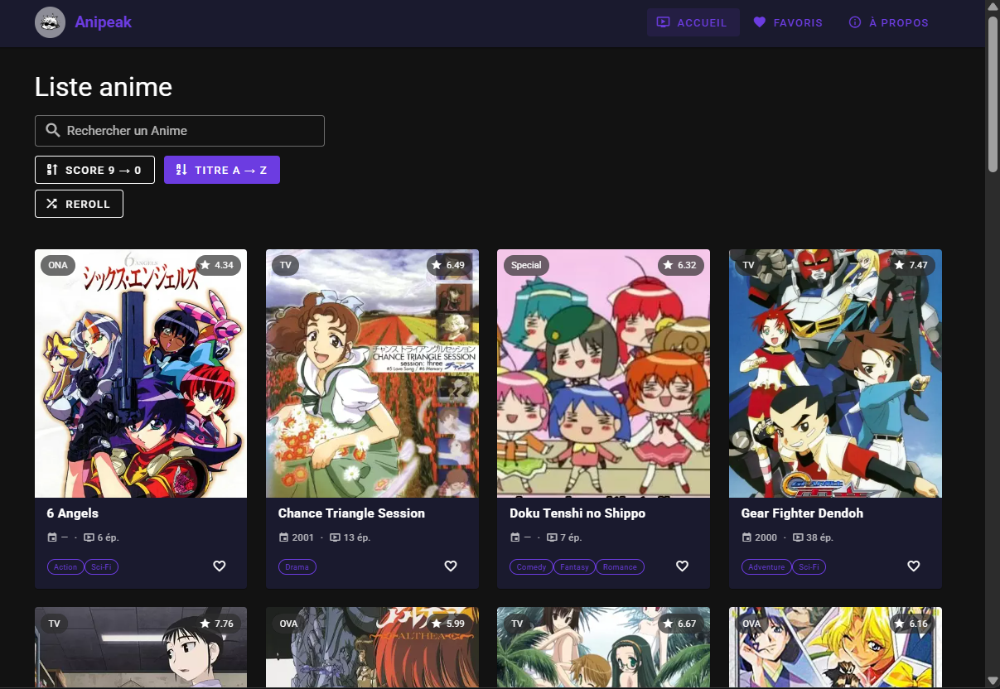
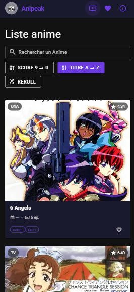
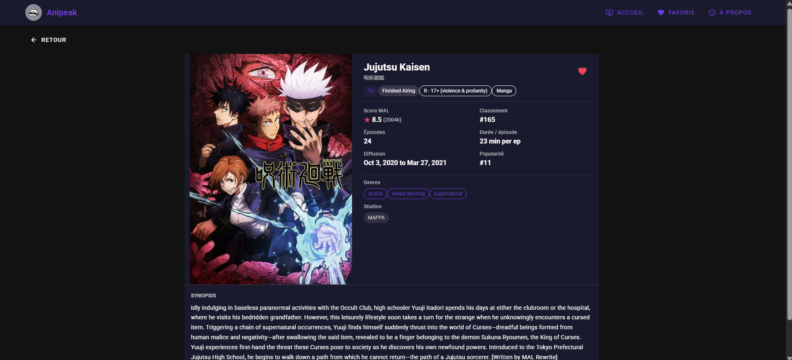
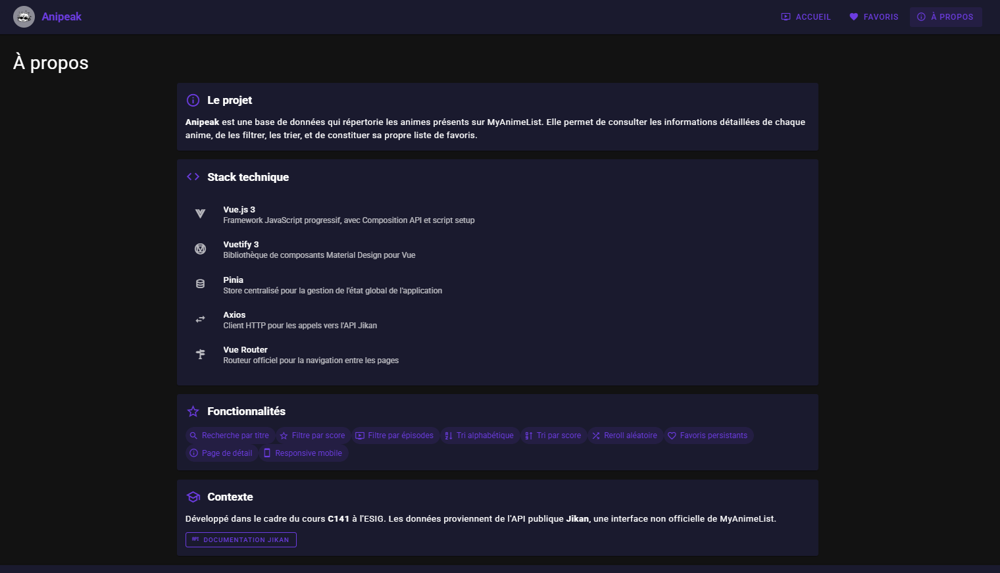

# Anipeak

Application Vue.js 3 + Vuetify 3

**Version desktop**



**Version mobile**



## Description

Anipeak est une application web de catalogue d'animes développée avec Vue.js 3, Vuetify, Pinia et Axios.
Elle s'appuie sur l'API publique Jikan (MyAnimeList) et a été réalisée dans le cadre du cours C141 à l'ESIG.

## Fonctionnalités

- Parcourir 25 animes aléatoires avec possibilité de reroll
- Rechercher un anime par titre (appel API en temps réel)
- Filtrer par tranche de score et par nombre d'épisodes
- Trier par titre (alphabétique) ou par score
- Consulter la page de détail d'un anime (score, genres, studios, synopsis...)
- Ajouter/retirer des favoris stockés dans le localStorage

Compléter l'application en suivant les étapes du cours :

## Aperçu de la solution

|                Page d'accueil                 |                 Fiche détail                 |                  À propos                  |
|:---------------------------------------------:|:--------------------------------------------:|:------------------------------------------:|
|  |  |  |

## Installation

```bash
git clone https://github.com/TheoBall-ESIG/141-JikanAPI-Project.git
cd 141-JikanAPI-Project
npm install
npm run dev
```

L'application s'ouvre sur [http://localhost:3000](http://localhost:3000).

un lien [Vercel](https://141-jikanapi-project.vercel.app/) est également disponible

## API Jikan

- **URL** : [`https://api.jikan.moe/v4`](https://api.jikan.moe/v4)
- **Documentation** : [https://docs.api.jikan.moe/](https://docs.api.jikan.moe/)
- **Réponse** : `{ data: [...], pagination: { has_next_page, items, ... } }`
- **Champs utiles** : `mal_id`, `title`, `title_english`, `title_japanese`, `images`, `score`, `scored_by`, `rank`, `popularity`, `episodes`, `duration`, `status`, `aired`, `type`, `source`, `rating`, `genres`, `studios`, `synopsis`, `year`

## Technologies

- [Vue.js 3](https://vuejs.org/) — Composition API
- [Vuetify 3](https://vuetifyjs.com/) — Composants Material Design
- [Vue Router 4](https://router.vuejs.org/) + unplugin-vue-router (routage automatique)
- [Vite](https://vitejs.dev/) — Build tool

## Utilisation IA

Version gratuite de Claude pour aide à la résolution de problèmes et certains ajouts par rapport à la solution de base